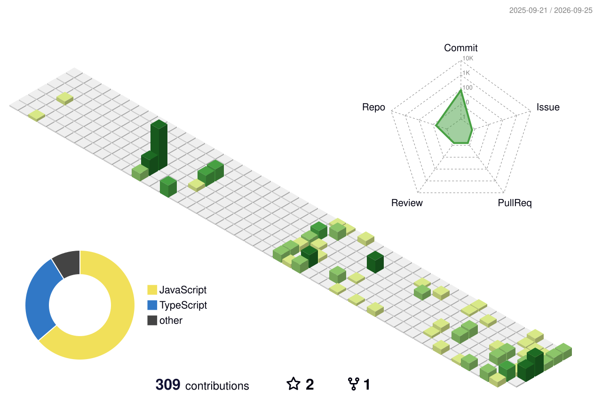

# Brandon MEDEHOU

**Développeur web & logiciels · Cotonou, Bénin**

Sites vitrines et back-offices sur mesure, livrés en semaines - pas en mois.

---

## En bref

Je dirige **BRANDYBEN**, une structure de développement web basée à Cotonou. Je conçois et développe des sites et applications sur mesure - le plus souvent pour des cabinets et PME en Afrique de l'Ouest - avec un back-office que le client prend en main lui-même, sans dépendre de moi pour chaque mise à jour.

- 🎓 5ᵉ année, développement informatique et de sites web
- 🇧🇯 Basé à Cotonou, disponible à distance
- 🛠️ Next.js, TypeScript, PHP, Vue.js, Supabase / PostgreSQL, Docker

## Actuellement

Développement complet du site et du back-office d'un cabinet d'architecture - portfolio filtrable, carte interactive, gestion éditoriale (projets, actualités, équipe) sans écrire une ligne de code côté client.
<!-- Brandon : remplace par le nom du cabinet + le lien du site en ligne une fois confirmé avec le client. -->

## Stack

## Projets

**Site et back-office d'un cabinet d'architecture** - Next.js, Supabase, carte interactive, gestion éditoriale complète.
<!-- Brandon : remplace par le nom du cabinet + le lien du site en ligne une fois confirmé avec le client. -->

**[moneroo-nodejs-sdk](https://github.com/Brandon22030/moneroo-nodejs-sdk)** - SDK Node.js/TypeScript non officiel pour l'API de paiement Moneroo (Afrique de l'Ouest).

**[Smart'Archi](https://portfolio-dave-gamma.vercel.app)** - Portfolio d'un dessinateur-projeteur bâtiment à Cotonou, spécialisé en visualisation 3D architecturale.

**[SGAMA](https://github.com/Brandon22030/SGAMA)** - Système de gestion d'atelier mécanique automobile.

**[Quizdeszeles](https://quizdeszeles.vercel.app)** - Plateforme de quiz bibliques en temps réel : création, partage par code, session live avec score et chronomètre.

**[Bénin Culture 360](https://github.com/Brandon22030/benin-culture-360)** - Application web interactive pour explorer et découvrir la culture béninoise.

**[Festivalis](https://github.com/Brandon22030/Festivalis)** - Plateforme d'événements communautaires pour le Bénin : cérémonies traditionnelles, mariages, événements culturels.

**[supabase-keepalive](https://github.com/Brandon22030/supabase-keepalive)** - Service planifié qui maintient actifs des projets Supabase gratuits pour éviter leur mise en veille automatique.

## Statistiques

<picture>
  <source media="(prefers-color-scheme: dark)" srcset="./profile-3d-contrib/profile-night-green.svg">
  <source media="(prefers-color-scheme: light)" srcset="./profile-3d-contrib/profile-green-animate.svg">
  
</picture>

